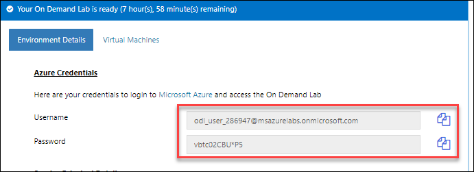
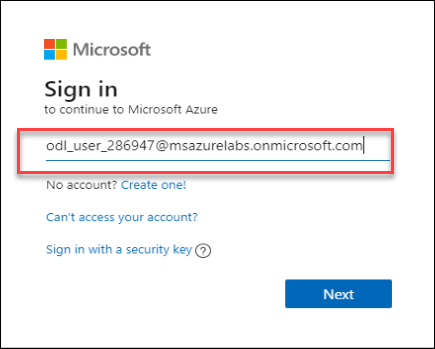
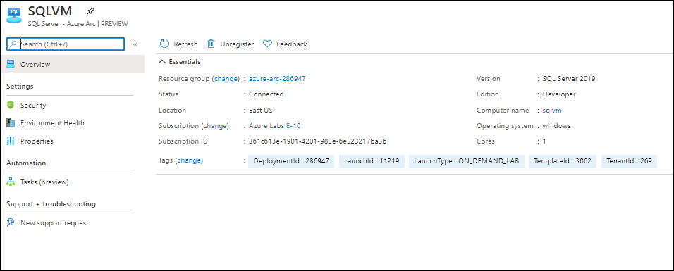

## Exercise 2: Onboard SQL Server to Arc. 
In this Exercise you will onboard SQL Server to Arc using Azure Portal and Powershell.

## Task 1: Login To Azure Portal.


 1: On you Jumpbox VM, Open Azure portal shortcut from the VM desktop.
  
   
   
 1: copy your azure credentials from the lab environment page to login to azure portal.
  
   
   
 1. Enter you Azure and password and click on next to login to azure portal.
  
   
   
 1. Now Click in search blade and search for SQL Server, now select **SQL Server - Azure Arc**.
 
   
   
 1. Now click on the **Create SQL Server - Azure Arc** button to create the SQL Server- Azure Arc. 
 
   
   
 1. Now you will see the prerequistes page, you can explore the page and just click on the **Next: Server details** button.
    
    - **Note**: We have already completed the prerequistes part for you. 
    
   
   
 1. Now on the **Server Details** blade enter the below details.
 
    - Subscription: Leave default
    - Resource group: Select **Azure-arc-SUFFIX** from dropdown list.
    - Region: Select same region as Resource group.
    - Operating Systems: Select **windows**.
      Now click on next button.
   
    
   
 1. Leave default for tags blade and click on **Next: Run Script** button.
 
 1. On the Script blade explore the script, we will be using this Powershell script to **Register Azure Arc enabled SQL Server**.
 
    - **Note:** You dont have to do anything here, we have already downloaded this script inside you VM.
    
     
   
   
## Task 2: Register Azure Arc enabled SQL Server.

 
 
 1: On your LabVM, Open **Windows Powershell** icon from the desktop.
 
    
  
 1. Nw run the below command to change the directory to where the Script is download.
  
     ``` C:\LabFiles ```
 1. After change the directory to Lab files, Run the below command to run the script inside the Labvm.

     ``` .\Execute-RegisterSqlServerArc.ps1 ```

 1. After running the command you will see the script started running.

    
  
 1. After some time you will see that the script execution is completed. Make sure that you see the below output.

    
  
 1. Now go back to azure portal and search for the **SQL Server -Azure Arc**, You will be able to see 1 one resource that we just created using powershell script in previous step.

    
  
 1. Select the **SQLVM** resource and now you can see the dashboard of **SQLVM** SQL Server -Azure Arc.

    
 

    
 
   
   
