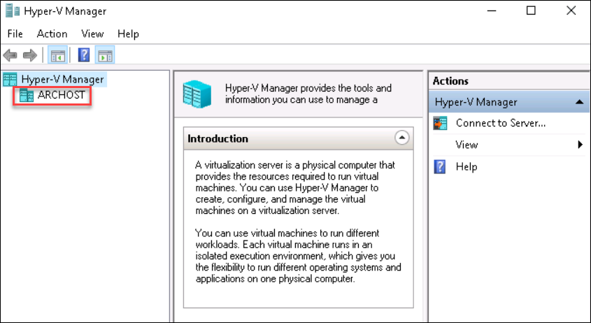
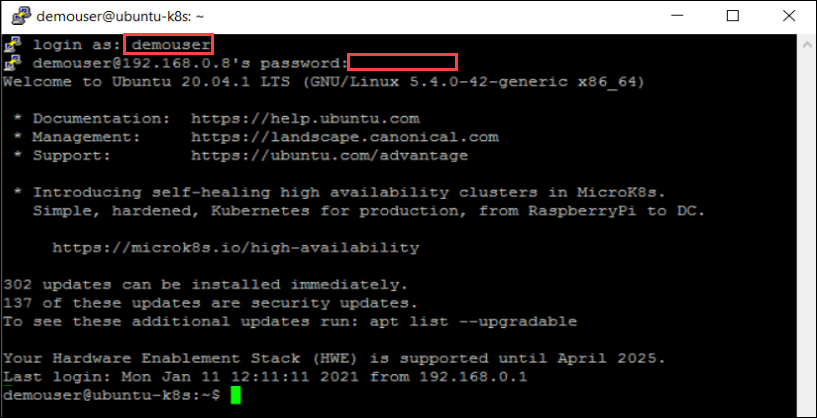

# Exercise 1: Connect On-Prem Servers to Azure with Arc

Azure Arc extends Azure Resource Manager capabilities to Linux and Windows servers, as well as Kubernetes clusters on any infrastructure across on-premises, multi-cloud, and edge. With Azure Arc, customers can also run Azure data services anywhere, realizing the benefits of cloud innovation, including always up-to-date data capabilities, deployment in seconds (rather than hours), and dynamic scalability on any infrastructure. Azure Arc for servers is currently in public preview.

## Task 1: Login and become familiar with Hyper-V Infrastructure

Hyper-V is Microsoft's hardware virtualization product. It lets you create and run a software version of a computer, called a virtual machine. Each virtual machine acts like a complete computer, running an operating system and programs. When you need computing resources, virtual machines give you more flexibility, help save time and money, and are a more efficient way to use hardware than just running one operating system on physical hardware. In this task, you will walk through on-prem environment which is hosted on Hyper-V. You will find three virtual machines hosted on Hyper-V server, which you will onboard to Azure Arc and play around.

1. You can see a virtual machine desktop 💻 (LabVM/ARCHOST) is loaded in the left side in your browser. Use this virtual machine throughout the workshop to perform the the lab. You can also connect to the virtual machine using RDP using the ARCHOST VM credentials provided on **Environment Details** tab. Double click on the **Hyper-V Manager** for VM desktop to start the Hyper-V Manager

    

1. Select **ARCHOST** to connect with Local Hyper-V server. In your Machine there could be a unique suffix added at end of **ARCHOST**, something like **ARCHOST-XXXXXX**.

    

1. You will find two guest virtual machines running on the Hyper-V manager. Find list of guest virtual machines with private ip address.
     * **ubuntu-k8s** - ```192.168.0.8```
     * **winvm** - ```192.168.0.5```
     
    

1. In this exescise, we will learn to onboard the Linux VMs and local kubernetes cluster to Azure Arc. So, here we will onboard **ubuntu-k8s** VM and the **MicroK8s** kubernetes cluster to Azure ARC. From the start menu of the ARCHOST VM, search for **putty** and open it with double click or other way.

    
     
1. In Putty Configuration tool, enter the **ubuntu-k8s** VM private IP - ```192.168.0.8```, make sure the Port value is ```22```. Once you entered the private IP of the ubuntuk8s vm, click on the Open to lunch the terminal.

    
    
1. Enter the ubuntu-k8s vm username - ```demouser``` in **login as** and then hit **Enter**. Now, enter the password - ```demo@pass123``` and press **Enter**. Remember password will be hidden and not be visible in terminal, don't worry about that.

    
    
    > Note: To paste any value in Putty terminal, just copy the values from anywhere and then right click on the Terminal to paste the copied value.
    
1. 
