# HOL-1: Exercise 2: Onboard Azure Arc enabled servers to Microsoft Sentinel and Security Center

In the last excercise, we had enabled Linux Machine and Kubernetes cluster on Azure Arc and verified it. Now let's see how to onboard your Azure Arc enabled server to Microsoft Sentinel and start collecting security-related events. Microsoft Sentinel provides a single solution for alert detection, threat visibility, proactive hunting, and threat response across the enterprise.

## Task 1: Onboard Azure Arc enabled servers to Microsoft Sentinel
Microsoft Sentinel comes with several connectors for Microsoft solutions, available out of the box and providing real-time integration. For physical and virtual machines, you can install the Log Analytics agent that collects the logs and forwards them to Microsoft Sentinel. Arc enabled servers supports deploying the Log Analytics agent using the following methods:

#### Using the VM extensions framework:
This feature in Azure Arc enabled servers allows you to deploy the Log Analytics agent VM extension to a non-Azure Windows and/or Linux server. VM extensions can be managed using the following methods on your hybrid machines or servers managed by Arc enabled servers:
 * The Azure portal
 * The Azure CLI
 * Azure PowerShell
 * Azure Resource Manager templates

#### Using Azure Policy:
You can use the Azure Policy Deploy Log Analytics agent to Linux or Windows Azure Arc machines built-in policy to audit if the Arc enabled server has the Log Analytics agent installed. If the agent is not installed, it automatically deploys it using a remediation task. Alternatively, if you plan to monitor the machines with Azure Monitor for VMs, instead use the Enable Azure Monitor for VMs initiative to install and configure the Log Analytics agent.

  > **Note** : You have already installed Log Analytics Agent into the Linux VM - ubuntu-k8s in the previous exercise. You can refer **Task 5** in the previous exercise to review it again. Also the screenshots of the log results can be mismatched because the result can take more time to get the same results. 
 
1. Search for ```Microsoft Sentinel``` on the Azure portal and, then select the **Microsoft Sentinel** from the search result.

   
    
2. On **Microsoft Sentinel** blade, click on **+ Create** to add Microsoft Sentinel to a workspace.
   > **Note**: You may also find **+ Add/+ New** button in place of **+ Create**. 

   
    
3. Select the existing log analytics workspace shown named LogAnalyticsWS-<inject key="DeploymentID/Suffix" /> and then click on the **Add** button.

   
    
4. You will see a notification on the upper right corner **Adding Microsoft Sentinel**. It will take around 1 minutes to get added.
    
5. Once the Microsoft Sentinel is added you will see another notification which says **Successfully added Azure Sentinel** as shown below.
     
   
 
6. Click on the **Overview** on Microsoft Sentinel page from where you can view the insights after few minutes. If you are not able to view the insights after a few minutes, then refresh the browser tab.
    
   
    
7. Now, click on the **Workbooks** from the left pane under the **Threat Management** section and search for ```Linux machines``` and select **Linux machines** from the search result.
    
   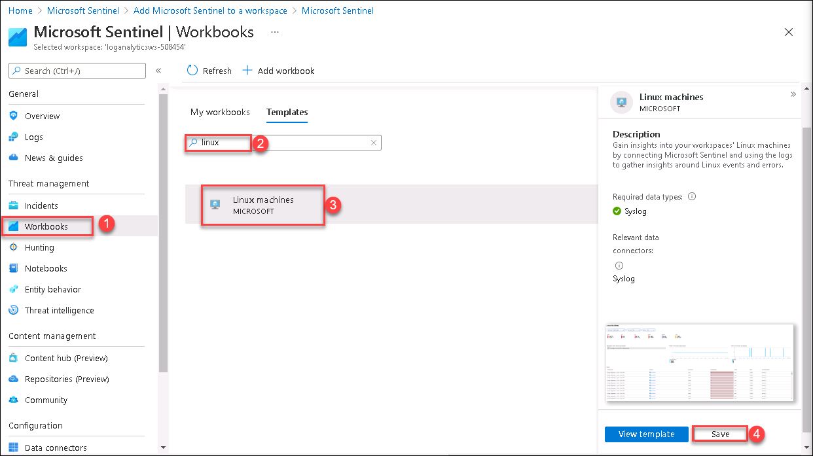
    
8. Then from the bottom-right corner of the Azure portal, click on **Save** and then on **OK** to save the workbook. 
 
   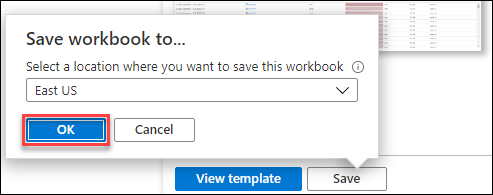
    
9. Now, go back to **Microsoft Sentinel Overview** blade by clicking on Overview under General section on the left and, then click on **INSIGHTSMETER** to query the **ubuntu-k8s** VM insights. Count of **Events** could be different on your Microsoft Sentinel Dashboard.

   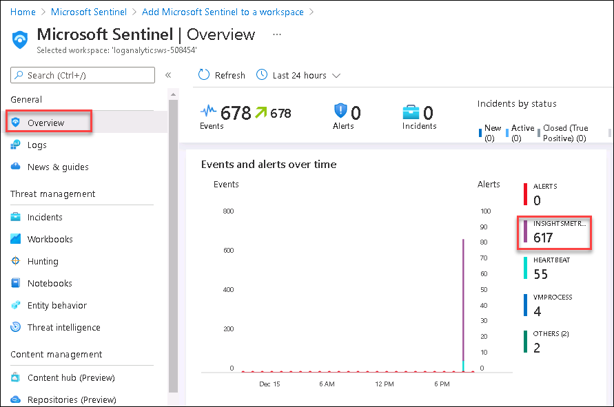
    
10. You will see **Results** for ```union InsightsMetrics``` in query explorer. You can see operations around Network, Logical Disk, Memory, and Processor for **ubuntu-k8s** VM. If you are not able to see the results, then try to adjust the query editor size and you will be able to see the outcome.

    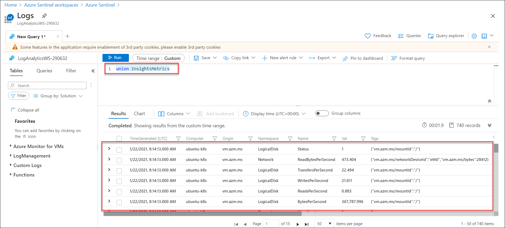
    
11. Let us check for **ubuntu-k8s** processes by running the following query, you can change the time range limit as well to see the result of a specific time interval. You can scroll right on the **Results** section and see more details and descriptions about every process. 

  > Note: The data might take around 30 mins to get populated. If you don't find the data, you can skip to Task 2: Enable Azure Security Center and come back later to this task to re-execute the query and filter the data.

   ```
   VMProcess 
   | where TimeGenerated > ago(24h) 
   | limit 10
   ```

  > Note: In the above query, against TimeGenerated,  ago(24h) means "24 hour ago" so this query only returns records from the last 24 hours.

   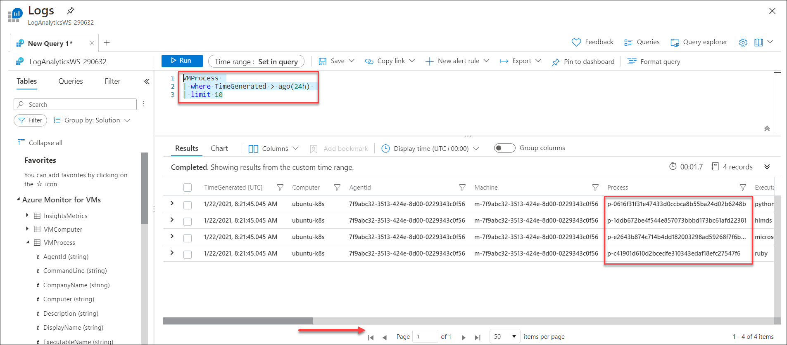   
    
12. You can save the query for later use by clicking on the **Save** button.

    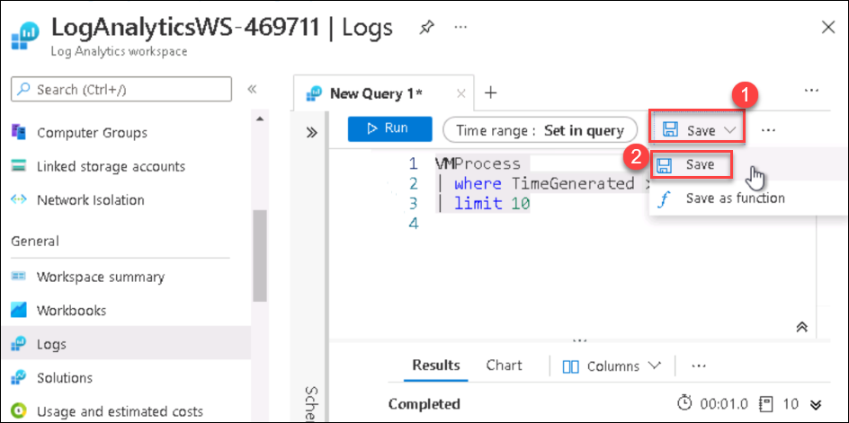 
   
13. Now, provide `VMProcess` for the **Query name (1)**, then click on **Save (2)**.

     

14. You can see and run the saved **queries** by browsing to **Queries**
   
     
   
15. Then, you will find `VMProcess` query under **Queries**, click on **Run** to run the querie.
   
    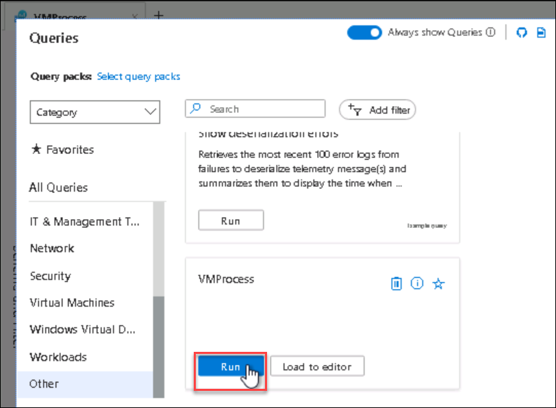 

    
## Task 2: Enable Azure Security Center
Security Center can monitor the security posture of your non-Azure computers, but first you need to connect them to Azure.
You can connect your non-Azure computers in any of the following ways:
  * Using Azure Arc enabled servers **(recommended)**
  * From Security Center's pages in the Azure portal **(Getting started and Inventory)**
 
1. Search for **Microsoft Defender for Cloud** in Azure portal search bar and then click on **Microsoft Defender for Cloud**.
    
   
   
1. From the Getting Started page, scroll down and then check on all the checkboxes and click on **Upgrade**. Please note in your lab environment you may find it already upgraded, in that case please skip this and next step.

   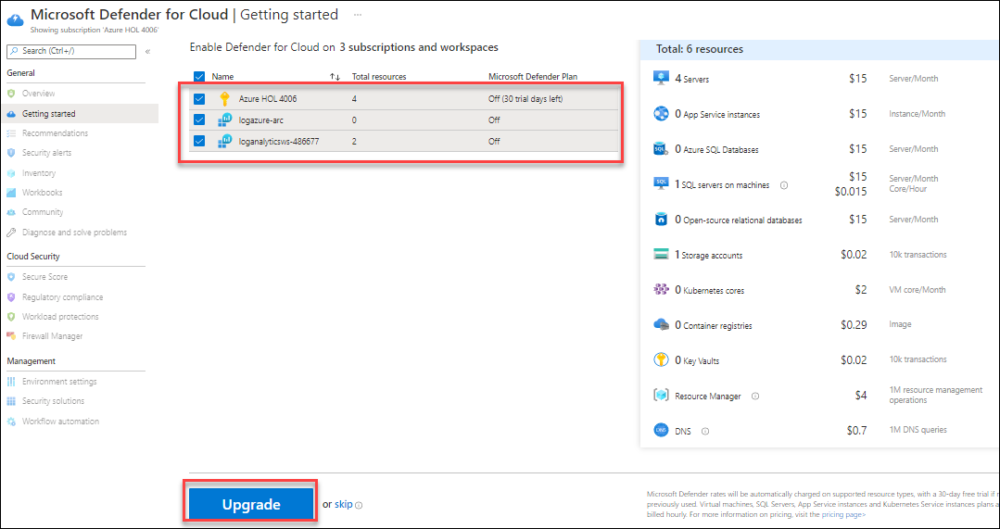
   
1. Now, select the subcription listed and click on **Install agents**.

   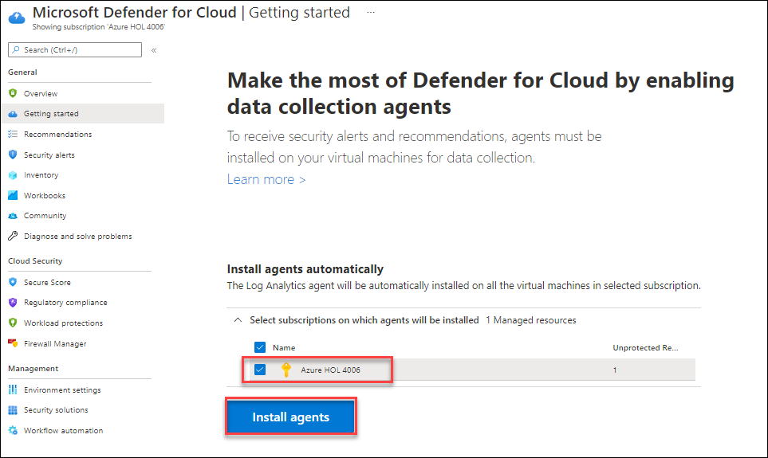

1. Click on **Inventory** from the **Microsoft Defender for Cloud**.

   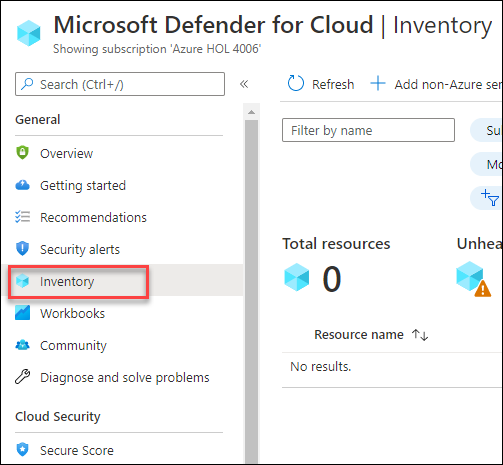
    
1. From the **Inventory** tab, click on the **Add non-Azure servers**.

   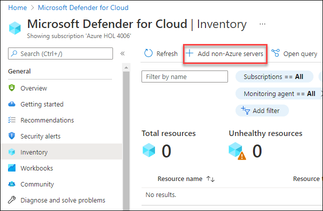
    
1. On **Onboard servers to Defender for Cloud** page, click on **Upgrade** next to the existing log analytics workspace named **LogAnalyticWS-<inject key="DeploymentID/Suffix" />** to upgrade. This will allow Azure Defender protection for your resources.

   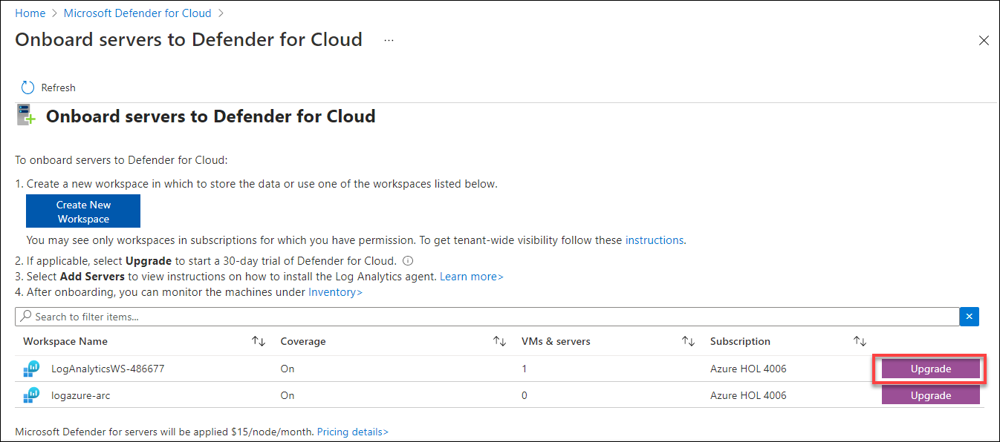
    
1. Now, close the blade and go back to **Inventory** tab and then you will see few connected resources. If you didn't see any resource, you will have to click on Refresh button at the top.

1. You can also find the **ubuntu-k8s** Arc enabled server  available in the resources list because **LogAnalytics** agent is already enabled for it and the same Log Analytics workspace is connected to Security Center. 

  > Note: Agent monitoring will take few minutes to update and show status as **Monitored** for Arc enabled server **ubuntu-k8s** as shown in below screen. You can continue to the next exercise and come back later to check on this. 
  > Please note that due to some latest updates the status is not changing to **Monitored** for Arc enabled server **ubuntu-k8s**, this is a temporary issue and will fixed in future updates.   

   

## In this exercise, you have covered the following:
 
   - Onboard Azure Arc enabled servers to Azure Sentinel.
   - Enable Azure Security Center.
