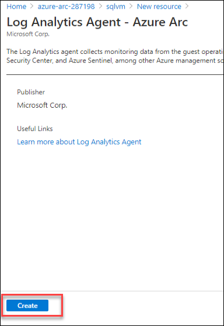

## Exercise 3: Onboard SQL Server to Arc
In this Exercise you will onboard SQL Server to Azure Arc using Azure Portal and Powershell.

## Task 1: Login To Azure Portal

1. In the **LabVM/ARCHost VM**, click on Azure portal shortcut of Microsoft Edge browser which is created on desktop.
  
    
   
1. On **Sign in to Micsoft Azure** tab you will see login screen, in that enter following **Email/Username** and then click on **Next**. 
   * Email/Username: <inject key="AzureAdUserEmail"></inject>
   
1. Now enter the following **Password** and click on **Sign in**.
   * Password: <inject key="AzureAdUserPassword"></inject>
   
1. If you see the pop-up **Stay Signed in?**, click No

1. If you see the pop-up **You have free Azure Advisor recommendations!**, close the window to continue the lab.

1. If **Welcome to Microsoft Azure** popup window appears, click **Maybe Later** to skip the tour.
      
1. Click in search blade and search for ```SQL Server```, select **SQL Server - Azure Arc**.
 
    
   
1. Click on the **Create SQL Server - Azure Arc** button to create the **SQL Server- Azure Arc**. 
 
    
   
1. You will see the prerequistes page, you can explore the page and just click on the **Next: Server details** button.
    
    - **Note**: We have already completed the prerequistes part for you. 
    
    
   
1. On the **Server Details** blade enter the below details.
 
     - Subscription: Leave default
     - Resource group: Select **Azure-arc-SUFFIX** from dropdown list.
     - Region: Select same region as Resource group.
     - Operating Systems: Select **windows**.
       Now click on next button.
   
    
   
1. Leave default for tags blade and click on **Next: Run Script** button.
 
1. On the **Script** blade explore the script, we will be using this Powershell script to **Register Azure Arc enabled SQL Server**.
 
     > **Note:** You dont have to do anything here, we have already downloaded this script inside you VM.
    
    
     
## Task 2: Register Azure Arc enabled SQL Server.

1. From your **LabVM/ARCHost VM**, Open **Windows Powershell** icon from the desktop.
 
    
  
1. Run the below command to change the directory to where the Script is download.
 
     ``` cd C:\LabFiles ```
     
1. After changing the directory to **Lab files**, Run the below command:

     ``` .\Execute-RegisterSqlServerArc.ps1 ```
     
    > Note: This will automatically run the **RegisterSqlServerArc.ps1** script inside **sqlvm** deployed on Hyper-V.

1. After running the command you will see the script started running.

    
  
1. After some time you will see that the script execution is completed. Make sure that you see the below output.

    
  
1. Go back to azure portal and search for the **SQL Server -Azure Arc**, You will be able to see 1 one resource that we just created using powershell script in previous step.

    
  
 1. Select the **SQLVM** resource and now you can see the dashboard of **SQLVM** SQL Server -Azure Arc.

    
 
 
## Task 3: Run on-demand SQL Assessment.

 1. Open Azure Portal and go to Resource group **azure-arc-SUFFIX** and search for **SQLVM* Server and select.
 
     
    
 1. Now Click on the **Extension** button from the left side menu and click on **Add** button to add a new extension.
 
    
    
 1. Select the **Log Analytics Agent - Azure Arc** extension.
 
    
    
 1. Now click on **Create** button to continue.
 
    
   
 1. At this step you have to enter Log analytics workspace ID and key to install the MMA in the **SQLVM**.
 
 1. Search for Log analytics workspace and select **Agent management** from the left side meny and copy the value of **Workspace ID** and **Primary Key** and save in a notepad for later use.
 
    
 
 1. Now enter the Workspace ID and Key that you copied from previoud step. and click on **Review + Create** button. 
 
    
   
    After few minutes the deployment will get completed and you can continue with the next task.
 
 1. Now go to **SQLVM** Azure Arc - SQL Server resource and Select the **Environment Health** under settings from left side menu.
    
    Now Select the below details:
    * **Account Type:** Select **Domain User Account** from the drop down menu.
    Now click on the **Download configuration Script** button to donwload the Powershell script.
    
    [](.././media/sqlvm.png "sqlsearch")
    
 1. Now you will see one powershell script is downloaded.
   
    [](.././media/download.png "sqlsearch")
    
 1. Now Open the powershell from your LABVM Desktop and run this command to copy this script in the **SQLVM** Machine.
    
    ``` Copy-VMFile "sqlvm" -SourcePath "C:\Users\arcadmin\DownloadsAddSqlAssessment.ps1" -DestinationPath "C:\LabFiles\DownloadsAddSqlAssessment.ps1" -CreateFullPath -FileSource Host ```
    
 1. Now Open your **SQLVM** from the Hyper-v Manager and enter **demo@pass123** to login.
 
 1. Open File explorer in the **SQLVM** and navigate to **C:\LabFiles\** this directory and right click on **DownloadsAddSqlAssessment.ps1** powershell script and select **Run with powershell** to run the powershell script to schdule the task that will generate the assessment and logs.
 
    [](.././media/file.png "sqlsearch")
    
 1. After running the Powershell script, Navigate to **C:\sqlserver\SQLAssessment** directory in File explorer and you will be able to see some files and folders. These are the assessments and logs that is generated using the powershell script.
 
 
 
    
    
