# HOL-3: Exercise 3: Azure Arc enabled SQL Managed Instance

Duration: 30 mins

Contoso has some applications that use SQL Server as the backend database. They have installed SQL Server on their Windows servers in their manufacturing plants but these locations don’t necessarily have local IT support to update the operating system and SQL Server with the latest security updates. They have explored Azure Database for SQL Server and found that it meets their requirements and offers some unique capabilities such as easy to manage and migrate from different cloud platforms. Therefore they are excited about the opportunity of deploying SQL Server in their Azure Arc enabled environment.

In this exercise, let's create an **Azure SQL Managed Instance - Azure Arc** in Indirect Mode and restore and migrate the database using multiple methods.

Also, we will be exploring the Kibana and Grafana Dashboards and upload the logs and metrics to the Azure portal and view the logs.

## Task 1: Create Azure Arc enabled SQL Managed Instance 

In this task, let's learn how to create Azure Arc enabled Azure SQL Managed Instance using Azure Arc Data controller.

1. Open **Azure Data Studio** from the desktop if not already opened. 
   Note: Azure Data Studio is a free cross-platform database tool for data professionals using on-premises and cloud data platforms on Windows, macOS, and Linux

1. Now, right click on the Azure Arc data controller connection, click on Manage, and then click on the **+ New Instance** button within the Azure Arc Data controller dashboard. 

   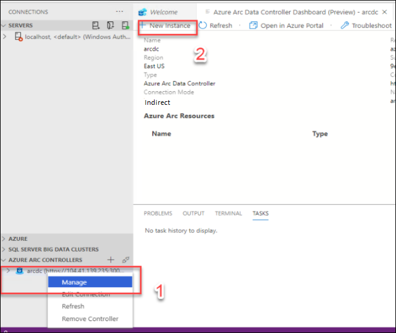
  
1. Now, select the **Azure SQL Managed Instance** and click on **Select** at the bottom of the page.

   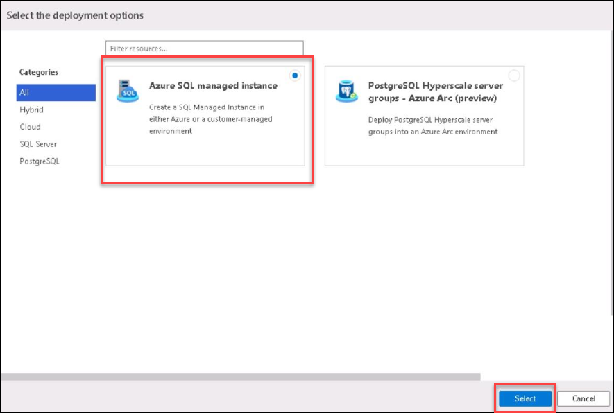
   
1. In the next page that opens up, select the **Checkbox** to accept the Microsoft Privacy statement and then click on **Next button** to proceed with the deployment. You can click on the privacy statement link to view the terms and conditions if you want to read through it.

   > **Note**: You will also see a **Required tools** table under the terms and conditions line. These tools are required to deploy the Azure Arc enabled Azure SQL Managed Instance. You don't have to worry about installation of any of those tools because we have already installed these required tools for you.

   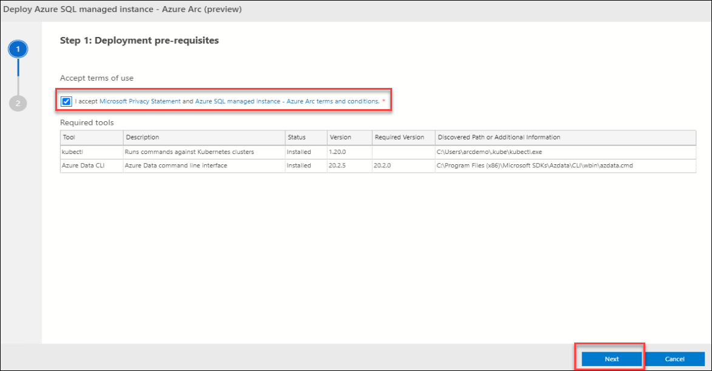

1. In the deploy **Azure SQL Managed Instance - Azure Arc blade**, enter the following information:

   **Under SQL Connection information**
   
   - **Instance name**: Enter arcsql
     ```BASH
     arcsql
     ```
   
   - **Username**:  Enter arcsqluser
     ```BASH
     arcsqluser
     ```
   
   - **Password**: Enter Password.1!!
     ```BASH
     Password.1!!
     ```
   
   **SQL Instance settings**
   
   
    - **Replicas**: Enter select 1
     ```BASH
     1
     ```
  
   - **Core Request**: Enter 1
     ```BASH
     1
     ```
   
   - **Core Limit**: Enter 2
     ```BASH
     2
     ```
   
   - **Memory Request**: Enter 2
     ```BASH
     2
     ```
   
   - **Memory Limit**: Enter 2
     ```BASH
     2
     ```
   
1. Click on the **Deploy** button to start the deployment of the  **Azure SQL Managed instance - Azure Arc** on the data controller.

   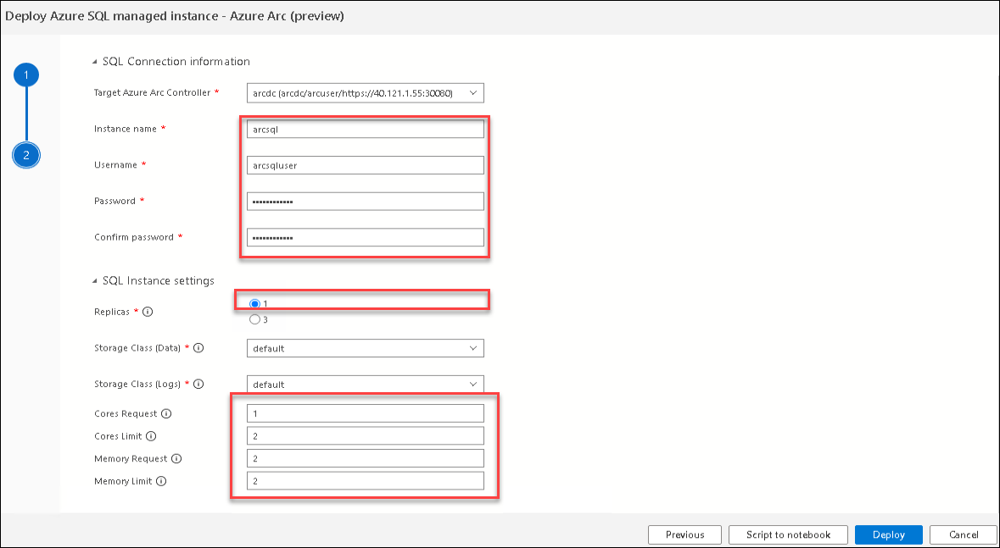
   
1. Now, select **New Python installation** and click on **Next** button.

   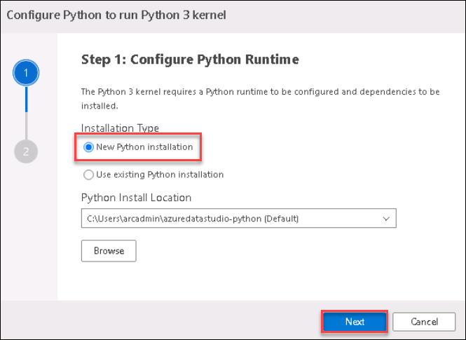
  
1. On Install Dependencies tab, click on **Install**.

   
     
1. After clicking on Install, a Notebook will open up and the cell execution will start automatically to deploy the **SQL Managed Instance**. Once the deployment is complete, you will see the text **arcsql is Ready** at the bottom of the notebook as shown in the screenshot. The deployment of **Azure SQL Managed instance - Azure Arc** will take around 5-10 minutes to complete, in this time you can explore through the commands in the notebook

   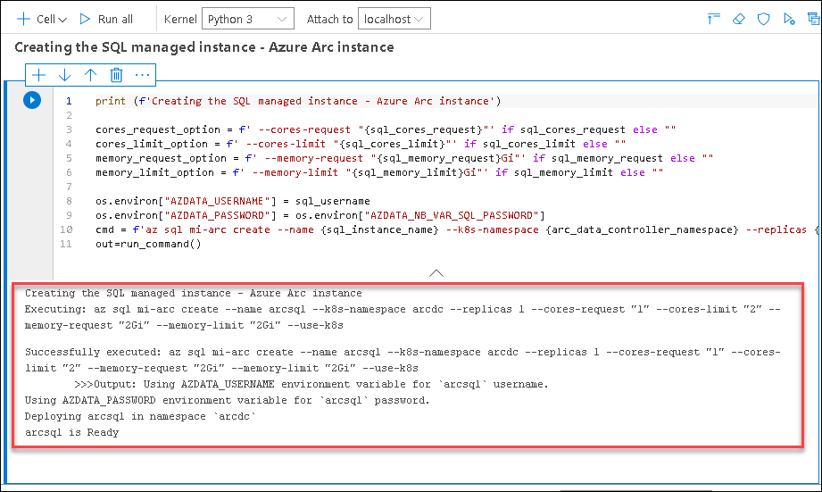

1. Once the installation is complete, in **Azure Arc Data Controller dashboard** under Azure Arc Resources you can see the newly created Azure Arc enabled Azure SQL Managed instance.

   

   > **Note**: You might have to right-click and refresh on Arc data controller to view the instance if you don't see one after seeing the text **arcsql is Ready** at the bottom of the notebook.

## Task 2: Connect to Azure Arc enabled Azure SQL Managed Instance using Azure Data Studio.

In this task, let us learn how to connect to your newly created Azure Arc enabled Azure SQL Managed instance using Azure Data Studio.

1. In the **Azure Arc Data Controller dashboard**, under Azure Arc Resources right-click on your newly created Azure SQL Managed instance and select manage, this will open  **SQL Managed instance - Azure Arc Dashboard**.

1. Now in the **SQL Managed instance - Azure Arc Dashboard**, copy the **IP Address** given under external endpoint. You can also see that the status is **Ready**.

   

1. In the Azure Data Studio, in connections tab, within the servers click on **Add Connection**.

   

1. Enter the following in the connection details page and click on **Connect**.

   - **Connection type** : Select **Microsoft SQL Server**.
   
   - **Sever**: Paste the external endpoint value of SQL Managed Instance which you copied earlier

   >**Note**: Make sure you have entered **IP Address** only and remove **port number**.
   
   - **Authentication type** : Select **SQL Login** from the drop down options
   
   - **User name** : Enter arcsqluser
     ```BASH
     arcsqluser
     ```
   
   - **Password** : Enter Password.1!!
     ```BASH
     Password.1!!
     ```
   
   
   
1. Now you can see that you are successfully connected with your Azure Arc enabled SQL MI Server. Under servers you can see that you are successfully connected with your Azure Arc enabled SQL MI Server. You can explore the SQL Managed Instance - Azue Arc Dashboard to view the databases and run a query.

   

## Task 3: Configure Azure Arc enabled Azure SQL Managed Instance

In this task, you will learn to update the configuration of Azure Arc enabled SQL Managed instances with Azure Data CLI.

1. If the **Command Prompt** window is already not opened, open a new one by clicking on Command Prompt icon from the desktop shortcut and run the following command to see configuration options of Azure SQL Managed instance.

   ```BASH
   az sql mi-arc edit --help
   ```

   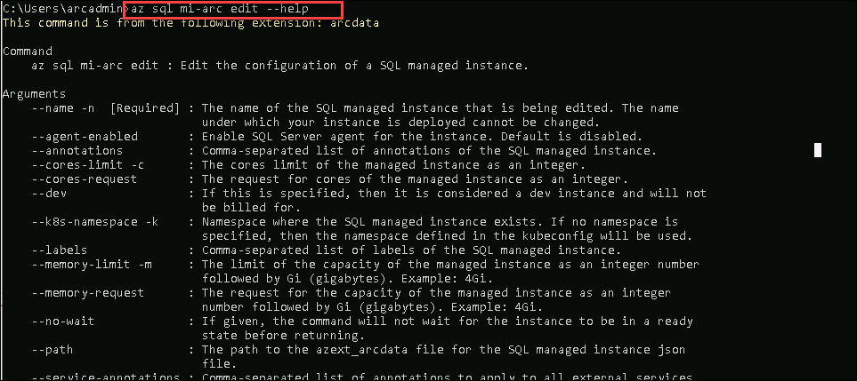

1. Now run the following command to set the custom CPU core and memory requests and limit. 

   >**Note**: The Azure SQL Managed instance name will be **arcsql** if you also provided the same for Instance name during creation of Azure SQL Managed Instance. The name is provided as value at the end of the command Also, you shouldn't select the Core and memory limit more than the given limits.

   ```BASH
   az sql mi-arc edit --cores-limit 3 --cores-request 2 --memory-limit 2Gi --memory-request 2Gi -n arcsql --k8s-namespace arcdc --use-k8s
   ```      

   

1. Now, you can run the below command to view the changes that you made to the Azure SQL Managed instance.

   >**Note**: The Azure SQL Managed instance name will be **arcsql** if you also provided the same for Instance name during creation of Azure SQL Managed Instance which is already added in the below command.
   
   ```BASH
   az sql mi-arc show -n arcsql --k8s-namespace arcdc --use-k8s
   ```

   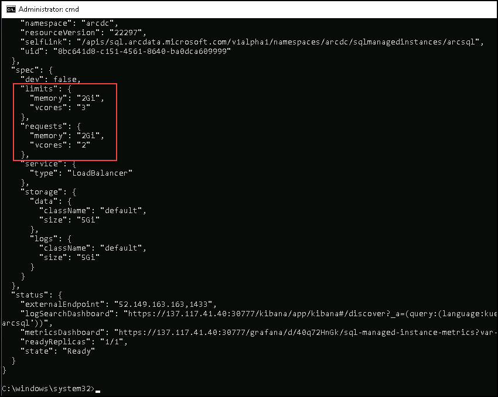

## Task 4: Restore the AdventureWorks sample database into Azure SQL Managed instance - Azure Arc Using Kubectl.

Migrating an existing SQL database from a SQL Server to Azure Arc enabled SQL MI is very simple. All you have to do is to take a backup from your existing SQL Server, and then restore that backup to SQL MI.

Now let's restore the sample backup file i.e AdventureWorks backup (.bak) into your Azure SQL Managed instance container using Kubectl commands.

1. Launch a **Command Prompt** window from the desktop of your JumpVM if you have already closed the existing one.

1. In the Command Prompt, run the following command to get the list of pods that are running on your data controller. 

   > **Note**: The namespace name for your data controller will be **arcdc**.

   ```BASH
   kubectl get pods -n arcdc
   ```
   
1. From the output of the above command, copy the pod name of the SQL MI instance from the output which will be in following format sqlinstancename-0. If you followed the same naming convention as in the instructions, the pod name will be **arcsql-0**.

   > **Note**: Please copy the Pod Name for the next step.

   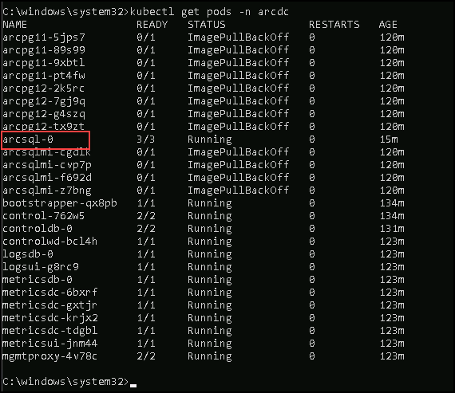
   
1. In the Command Prompt, run the following command after replacing the required values. This will remotely execute a command in the Azure SQL Managed instance container to download the .bak file onto the container.

   >**Note**: The value of the namespace name and pod name is already updated in the below command. Please confirm if the pod name that copied matches the one given below: arcsql-0. 

   ```BASH
   kubectl exec arcsql-0 -n arcdc -c arc-sqlmi -- wget https://github.com/Microsoft/sql-server-samples/releases/download/adventureworks/AdventureWorks2019.bak -O /var/opt/mssql/data/AdventureWorks2019.bak
   ```

   > ```Info:``` arc-sqlmi in the above command is the name of the container within the SQL Managed Instance Pod arcsql-0   

   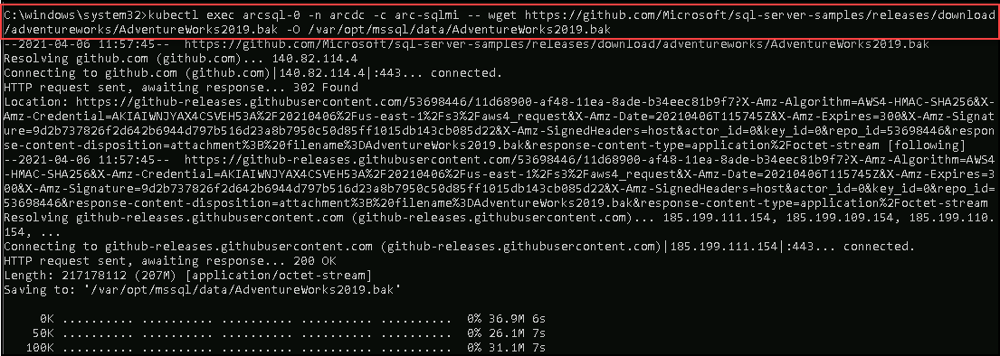

1. Now, to restore the AdventureWorks database, you can run the following command.

   > **Note**: All values including the pod and the namespace name have already been added. You can go through the command and figure out what all are being passed as arguements.

   ```BASH
   kubectl exec arcsql-0 -n arcdc -c arc-sqlmi -- /opt/mssql-tools/bin/sqlcmd -S localhost -U arcsqluser -P Password.1!! -Q "RESTORE DATABASE AdventureWorks2019 FROM  DISK = N'/var/opt/mssql/data/AdventureWorks2019.bak' WITH MOVE 'AdventureWorks2017' TO '/var/opt/mssql/data/AdventureWorks2019.mdf', MOVE 'AdventureWorks2017_Log' TO '/var/opt/mssql/data/AdventureWorks2019_Log.ldf'"
   ```

   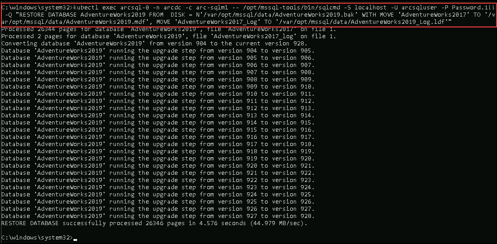

1. Now you can switch back to Azure Data Studio.

1. Then, right-click on the SQL Managed Instance Server under CONNECTIONS tab on the top left of the Azure Data Studio

1. And, then click on refresh.

1. Now, expand your SQL Managed Instance server if not already by clicking on the arrow icon on the left of the IP Address, then expand Databases and verify that AdventureWorks2019 Database is listed there.

   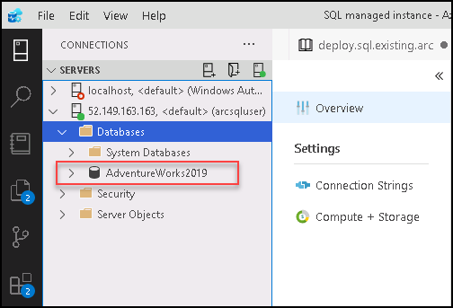

## Task 5: Migrate and Restore SQL Server DB to Azure Arc enabled Azure SQL Managed instance from Blob storage and Azure arc pod.

Now that we have the Azure SQL Managed instance ready, let's migrate and restore the SQL server database to the Azure arc enabled SQLMI. 
   
There are two methods to do the migration and restore - One is by using the Azure blob storage to back up and restore DB to SQLMI, and the Second one is by using the kubectl commands. 

 **Method 1: Using Azure blob storage** 
 
 **Step 1: Migrate: SQL Server to Azure Arc enabled Azure SQL Managed instance**

1. Navigate to Azure Portal Home - https://portal.azure.com/home and login if you haven't already.

1. From the home page, select Resource groups from under Navigate or Azure services.

   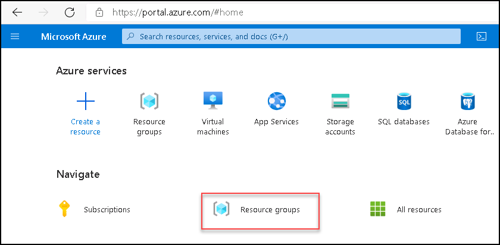

1. From the list of resource groups in the next page, click on the **azure-arc** resource group. 

1. From the next page, you will be able to find a resource of type Azure blob storage with name as **arcstorage<inject key="DeploymentID/Suffix" />**. Click on that resource. 

   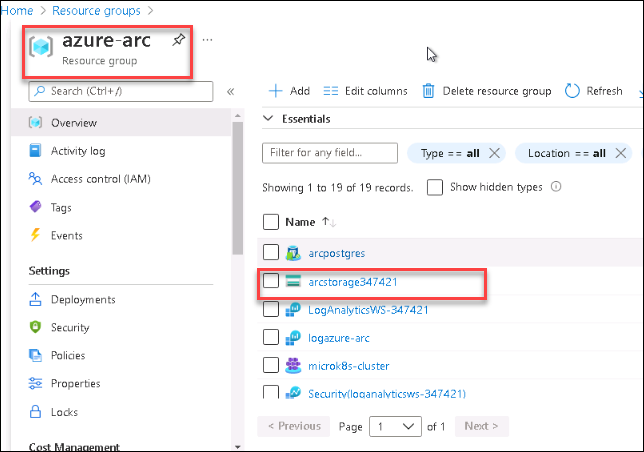

1. You will be directed to the overview blade of the resource. Then, scroll down the menu on the left side bar and click on the **Shared access signature**. Now click on the **Generate SAS and connection string** button to get the keys.

   > **Note**: Before generating SAS token make sure all the three check boxes(Service, Container, Object) under **Allow resource types** are checked. Also, you can update the expiry Date/Time to match your requirement

   
   
   > **Info**: **Shared Access Signature** makes sure that the database backups are only available for authorized users. 

   

1. Now you will be able to see the storage account name at the top and Shared access signature token. Copy the Storage account name and SAS token from the portal and save it in a **notepad** for later usage. Then, click on Overview from the left tab and then select **Containers** and copy the container name onto the notepad for later use.

   

   > **Note**: After copying SAS token to notepad remove **?** at the beginning of the token before using it later.

   

1. In Azure Data Studio, to connect the Source SQL Server, Click on the **New Connection** Button to add the details. 

   

1. Provide the following details in the blade that comes up:
   
   - Select Connection type as **Microsoft SQL Server**
   - **Server**: **localhost**

      ```
      localhost
      ```

   - **Authentication type**: **Windows Authentication**
     
1. Click on **Connect** button after entering the above values.
   
   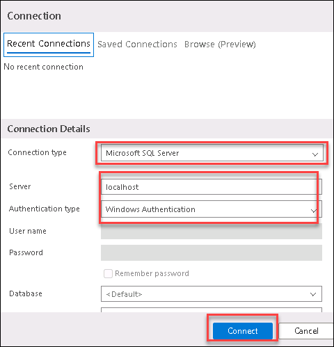
   
1. After connecting, **expand** the localhost server from within the server tab on the left and click on the databases folder and right-click on **AdventureWorks2019** Database, and select **New Query**.

   

1. Copy the query into the Azure Data Studio **Query Editor** window and prepare your query by replacing the placeholders indicated by the <...> using the **Storage account name** and **SAS token** in earlier steps. 

   Once you have replaced the values, run the query by clicking on **Run button**. 

   ```BASH
   CREATE CREDENTIAL [https://<storage-account-name>.blob.core.windows.net/arcstorage] WITH IDENTITY = 'Shared Access Signature' 
   ,SECRET = '< replace with sas token >'
   ```

   Once you verify that the Command is executed successfully go to the next step.
          
   

1. Similarly, prepare the BACKUP DATABASE command by copying the below query and replacing the existing query in the Query Editor to backup the database to the blob container. 

   Make sure you replace the value of **Storage account name**. Once you have replaced the values, you can run the query. 

   ``` 
   BACKUP DATABASE AdventureWorks2019 TO URL = 'https://<storage-account-name>.blob.core.windows.net/arcstorage/AdventureWorks2019.bak'; 
   ```

   Once you see that the command is executed successfully, you can go to the next step.

   
   
1. Navigate to Azure portal and validate that the backup file created in the previous step is visible in the Blob container. For this, you have to go to the storage account and click on the **container** button and then open the **arcstorage** to view the backup file.
  
   

**Step 2: Restore the database from Azure blob storage to Azure SQL Managed instance - Azure Arc**

1. Navigate back to Azure Data Studio, login and connect to the Azure SQL Managed instance - Azure Arc if not already .

1. Expand the System Databases under Azure SQL Managed Instance connection.

1. Then, right-click on the **master** database, and select **New Query**.

   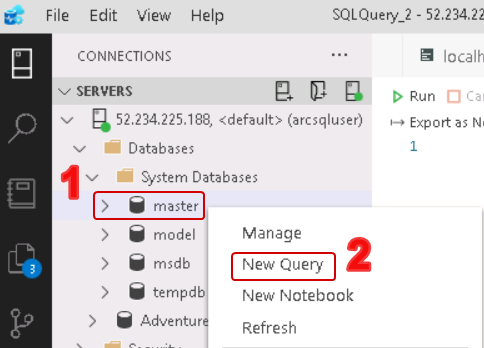

1. In the query editor window, prepare and run the below query by replacing with the required values to create the credentials.

   ```
   CREATE CREDENTIAL [https://<storage-account-name>.blob.core.windows.net/arcstorage] WITH IDENTITY = 'Shared Access Signature' 
   ,SECRET = '< SAS >'
   ```
 
1. Prepare and run the below command to verify the backup file is readable and intact. Make a note of logical names from the output windows.

   ```
   RESTORE FILELISTONLY FROM URL = 'https://<storage-account-name>.blob.core.windows.net/arcstorage/AdventureWorks2019.bak'

   ```

1. Prepare and run the RESTORE DATABASE query as follows to restore the backup file to a database on Azure SQL Managed instance - Azure Arc. Make sure to replace the **storage account name** in the below query before running it. 

   ```
   RESTORE DATABASE AdventureWorks2019 FROM URL = 'https://<storage-account-name>.blob.core.windows.net/arcstorage/AdventureWorks2019.bak'
   WITH MOVE 'AdventureWorks2017' to '/var/opt/mssql/data/AdventureWorks2019.mdf'
   ,MOVE 'AdventureWorks2017_log' to '/var/opt/mssql/data/AdventureWorks2019.ldf'
   ,RECOVERY  
   ,REPLACE  
   ,STATS = 5;  
   GO
   ```
   
   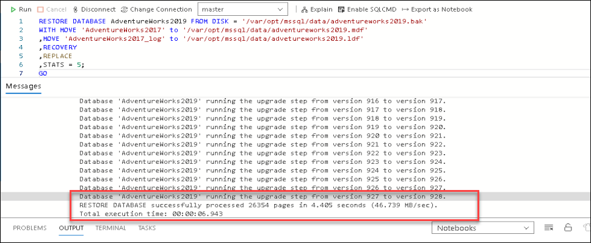
    
**Method 2: Copy the backup file into an Azure SQL Managed instance - Azure Arc pod using kubectl**
   
This method shows you how to take a backup file that you create via any method and then copy it into local storage in the Azure SQL Managed instance pod.
   
So you can restore from there much like you would on a typical file system on Windows or Linux.
   
In this scenario, you will be using the command kubectl cp to copy the file from one place into the pod's file system.
   
1. Connect to the **localhost** SQL Server using Azure Data Studio and right-click on the **master** database and then, click on the **new query** and paste the below query.
   > **Note**: Make sure that you are running this query in **localhost** database.
   
   ```
   BACKUP DATABASE AdventureWorks2019
   TO DISK = 'c:\tmp\adventureworks2019.bak'
   WITH FORMAT, MEDIANAME = 'AdventureWorks2019' ;
   GO
   ```
    
2. Navigate to **Command Prompt** Window you have already opened and run the below command to get the **SQLMI pod name**.
   
   ```
   kubectl get pods -n arcdc
   ```

3. Copy the backup file from the **local** storage to the **SQL pod** in the cluster using the below SQL query. Make sure you **replace** the SQLMI pod name and DB name.
   
   ```
   kubectl cp /tmp/AdventureWorks2019.bak arcsql-0:var/opt/mssql/data/adventureworks2019.bak -c arc-sqlmi -n arcdc
   ```

   > ```Note:``` We have already replaced the value of container and pod in the above command. 

4. Now, switch back to **Azure data studio** and open a **new query** in SQLMI instance and run the below query to restore the database to the Azure SQL Managed instance - Azure arc
     
   ```
   RESTORE DATABASE AdventureWorks2019 FROM DISK = '/var/opt/mssql/data/adventureworks2019.bak'
   WITH MOVE 'AdventureWorks2017' to '/var/opt/mssql/data/adventureworks2019.mdf'  
   ,MOVE 'AdventureWorks2017_log' to '/var/opt/mssql/data/adventureworks2019.ldf'  
   ,RECOVERY  
   ,REPLACE  
   ,STATS = 5;  
   GO
   ```

5. Now you have seen how the database can be restored in different ways.
   
## Task 6: View SQL MI resource and SQL MI logs in Azure portal.
   
Now that we have the database created, let us upload some metrics, usages, and logs to the Azure Portal and view SQLMI Resource in the Azure portal.
   
1. Navigate back to the **command prompt** window. 

1. Run these below commands to check if the variables are set or not.
   
   ```BASH
   echo %WORKSPACE_ID%
   ```

   ```BASH
   echo %WORKSPACE_SHARED_KEY%
   ```

   ```BASH
   echo %SPN_TENANT_ID%
   ```

   ```BASH
   echo %SPN_CLIENT_ID%
   ```

   ```BASH
   echo %SPN_CLIENT_SECRET%
   ```

   ```BASH
   echo %SPN_AUTHORITY%
   ```
       
1. If the variables are not defined, set it now using the below commands.
   
   ```
   SET WORKSPACE_ID=<workspaceId>
   ```

   ```
   SET WORKSPACE_SHARED_KEY=<primarySharedKey>
   ```

   ```
   SET SPN_CLIENT_ID=<appId>
   ```

   ```   
   SET SPN_CLIENT_SECRET=<password>
   ```

   ```
   SET SPN_TENANT_ID=<tenant>
   ```

   ```
   SET SPN_AUTHORITY=https://login.microsoftonline.com
   ```

   > **Note**: You can get the workspace ID and key from the Azure portal and service principal details from the Environment Details tab at the top and then navigating to Service Principal details.

1. Export all logs to the specified file:
   
   ```
   az arcdata dc export --type logs --path logs.json --k8s-namespace arcdc --use-k8s
   ```
   > **Note**: You may see a message "logs.json already exists already, do you want to overwrite it? (Y/N):", then enter `Y` to overwrite. Also if you see any bypass server certificate check, then please enter 'y' to continue. The data will be exported to this location: 'C:\Users\arcadmin\logs.json'

1. Upload logs to an existing Azure monitor log analytics workspace:
   
   ```
  az arcdata dc upload  --path logs.json
   ```
      
1. After some time, you will see some outputs uploaded to Azure.

   
    
1. Now open the Azure portal and search for **Azure SQL Managed instances - azure arc**  and select the resource.

   
      
1. Now you will see some basic information about the Azure Arc enabled SQL Managed Instance.
      
   
   
1. Now to view your logs in the Azure portal, open the Azure portal and then search for your log analytics workspace by name in the search bar at the top and then select it.

1. In the **Log Analytics workspaces** page, select your workspace **logazure-arc**.
   
   

1. Then, from the left navigation menu under **General** select **Logs**

1. Now in your page that opens up, click on the ```X```  at the top right corner as shown in the below image.

   
   
1. And then, click on ```>>``` icon to expand the Schema and Filter tab.

   

1. Then, check if CustomLogs is there under Tables section. If you don't see CustomLogs there, refresh the page every 2 minutes until it is available.
     
   

1. Once the Custom logs is available, expand Custom Logs at the bottom of the list of tables and you will see a table called **sqlManagedInstances_logs_CL**.
   
   

1. Right click on the table name and select the **Use in the editor** button.
   
   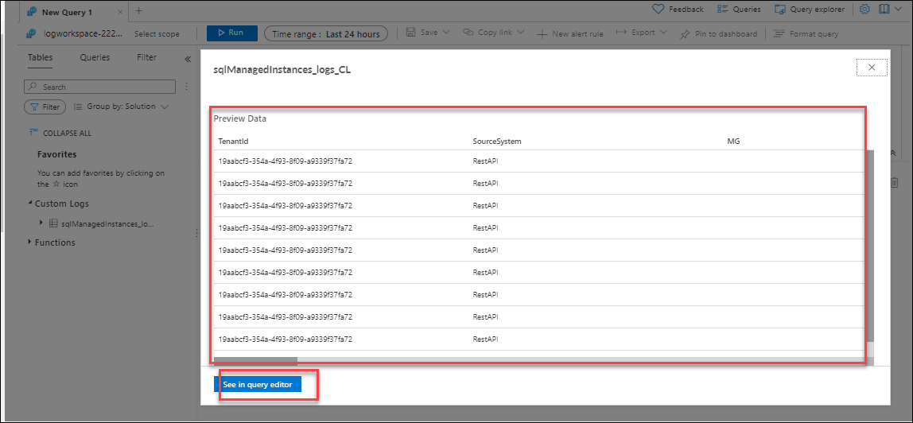

1. Now, you will have a query in the query editor. Run the query that will show the logs. 
   
   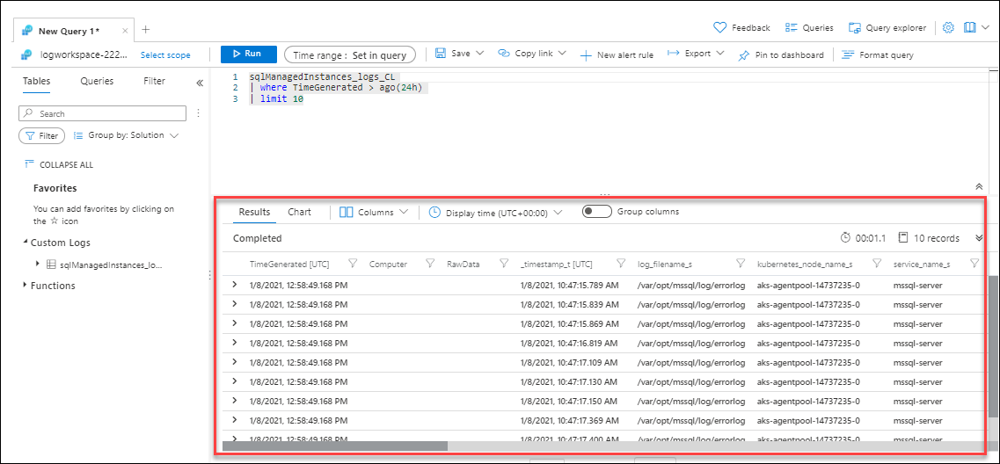

   > Note: You might have to resize the editor and output windows to view the logs.

## Task 7: Monitor with Azure Data Studio

Now let us Monitor the SQL MI status using Grafana and Kibana.
  
1. Now, go back to the **Azure Data Studio** and right-click on the ```arcsql``` resource under the Azure Arc controller and click on **manage**.
  
1. Now, copy the **endpoint** for **Kibana dashboard** and browser this endpoint in a browser.
  
1. Enter below user name and password for SQLMI.
  
   > **Note** You have to enter the credentials of Azure Arc data controller.
  
   - **User name** : arcuser
     ```BASH
     arcuser
     ```

   - **Password** : Password.1!!
     ```BASH
     Password.1!!
     ```

   
   
   > ***Info***: You can filter the results by searching in the top bar for  **arcsql**. That will filter this page to just the logs for the managed SQL Server instance.
  
   

1. You can explore the **kibana dashboard**. 
  
   > ***Info***: You can learn more about kibana here: [View logs and metrics using Kibana and Grafana](https://docs.microsoft.com/en-us/azure/azure-arc/data/monitor-grafana-kibana)
    
## View the Visualization and metric using grafana graph
  
1. Now, go back to the **Azure Data Studio** which you had opened earlier.
  
1. Now, copy the **endpoint** for the **Grafana dashboard** and browser this endpoint in a browser.
  
1. Enter below user name and password for SQLMI.
  
   > **Note** You have to enter the credentials of the Azure Arc data controller.
      
   - **User name** : arcuser
     ```BASH
     arcuser
     ```

   - **Password** : Password.1!!
     ```BASH
     Password.1!!
     ```

   
   
1. You can explore the page for Grafana. 
  
   > ***Info***:  You can learn more about Grafana here: [View logs and metrics using Kibana and Grafana](https://docs.microsoft.com/en-us/azure/azure-arc/data/monitor-grafana-kibana)  
  

## After this exercise, you have performed the following

   - Created Azure SQL Managed instance.
   - Connected to Azure Arc enabled Azure SQL Managed instance.
   - Configured Azure Arc enabled SQL Managed Instance.
   - Restored the AdventureWorks sample database into Azure SQL Managed instance - Azure Arc.
   - Migrated and Restored SQL Server DB to Azure Arc enabled Azure SQL Managed instance from Blob storage and Azure arc pod.
   - Viewed SQL MI resources and logs in Azure portal.
   - Monitored with kibana and grafana.
