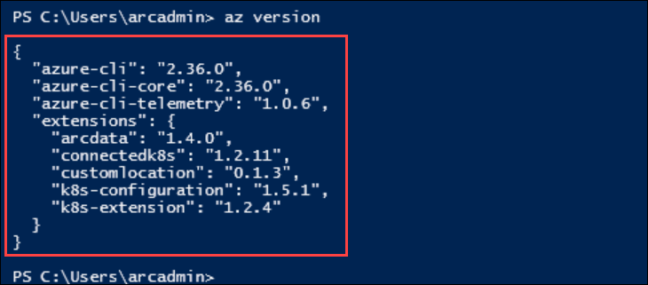

# Exercise 1: Deploy Azure Arc Data Controller 
  Duration: 30 Minutes
  
 In this exercise you will connect an existing Kubernetes cluster to Azure using Azure Arc-enabled Kubernetes. You will also deploy an Azure data controller in direct connectivity mode to a customer location using Azure portal and Azure CLI. 
 
 
# Connect an existing Kubernetes cluster to Azure using Azure Arc-enabled Kubernetes
 
## Task 1: Login to Azure and install Azure CLI extensions.
 
1. Open **Windows PowerShell** from the desktop of your ARCHOST VM and run the below command to login to Azure.
    ```
    az login
    ```
1. After running the above command a browser tab will open to login to azure portal.
 
1. On the **Sign into Microsoft Azure** tab you will see the login screen, in that enter following **Email/Username** and then click on **Next**. 
   * Email/Username: <inject key="AzureAdUserEmail"></inject>

1. Now enter the following **Password** and click on **Sign in**.
   * Password: <inject key="AzureAdUserPassword"></inject>

1. After adding the creds you will see that you have logged into the Microsoft Azure.

    

1. Now switch back to Windows PowerShell and you will be able to see that you have logged in to Azure.

1. Run the below commands to install required Azure CLI extensions.
   
   ```
   az extension add --name k8s-extension
   az extension add --name connectedk8s
   az extension add --name k8s-configuration
   az extension add --name customlocation   
   ```
   
   
   
1. You can validate you have all the required extensions with the latest versions by running the below command: 
   
   ```
   az version
   ```   
   
   
   
1. After making sure the required tools are installed, next step is to register your subscription with Arc for Kubernetes.

1. Run the below commands to register the required Resource providers if not already registered. 

   ```
   az provider register --namespace Microsoft.Kubernetes
   az provider register --namespace Microsoft.KubernetesConfiguration
   az provider register --namespace Microsoft.ExtendedLocation
   ```
   
   
   
## Task 2: Onboard an existing Kubernetes cluster to Azure using Azure Arc-enabled Kubernetes.

In this Task you will be connecting an existing Kubernetes cluster to Azure using Azure Arc-enabled Kubernetes and will be enabling custom features by adding an Azure Arc data services extension and a custom location on the Azure Arc-enabled Kubernetes cluster. 

1. Also, you should reword this to: Run the below command to connect the existing Kubernetes to your Azure subscription using Azure Arc-enabled Kubernetes. Once you run the below command, it will take a few minutes to onboard the cluster to Azure Arc. 

   ```
   az connectedk8s connect --name Arc-Data-Demo-DirectMode --resource-group azure-arc
   ```
  
   > **Note:** We have already defined your Cluster name and Azure resource group name in the above commands, If you are trying this in your own subscription, please make sure that you have entered correct details.
 
1. Once the previous command is executed successfully, the provisioning state in output will show as succeeded.

     
 
1. Verify whether the Azure Arc-enabled Kubernetes cluster is onboarded and connected to the resource group in the Azure subscription by running the following command:

   ```
   az connectedk8s list -g azure-arc -o table 
   ``` 
   
   
   
1. Azure Arc-enabled Kubernetes deploys a few operators into the azure-arc namespace. You can view these deployments and pods by running the command in the command prompt:  

   ```
   kubectl -n azure-arc get deployments,pods
   ```
   
   The output should be similar as shown below:
    
   
