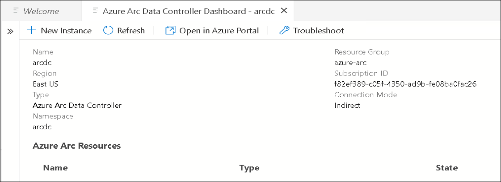
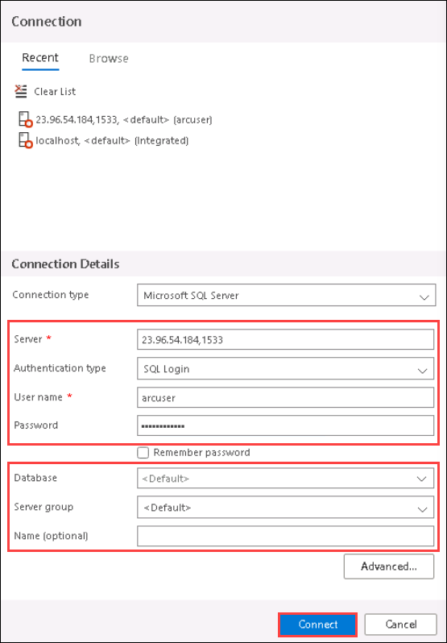
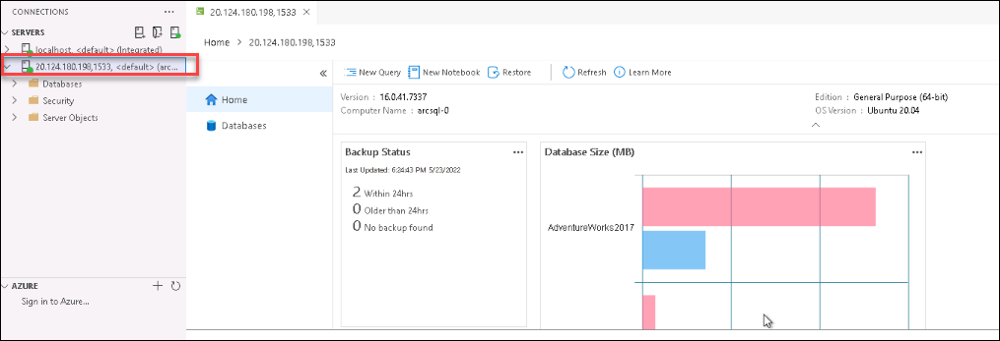
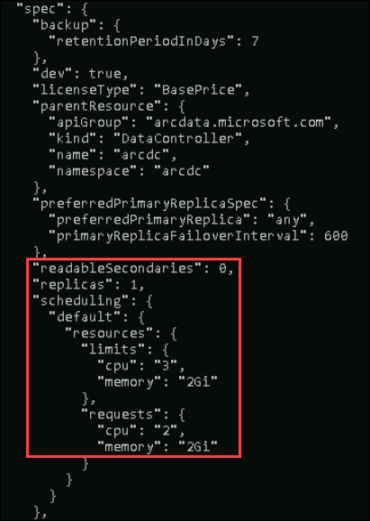

# Exercise 2: Connect to data controller disconnected mode and deploy SQLMI business critical using Azure Data Studio 

Contoso has some applications that use SQL Server as the backend database. They have installed SQL Server on their Windows servers in their manufacturing plants but these locations don’t necessarily have local IT support to update the operating system and SQL Server with the latest security updates. They have explored Azure Database for SQL Server and found that it meets their requirements and offers some unique capabilities such as easy to manage and migrate from different cloud platforms. Therefore they are excited about the opportunity of deploying SQL Server in their Azure Arc enabled environment.

In this exercise, let's create an Azure SQL Managed Instance - Azure Arc in Indirect Mode and restore and migrate the database using multiple methods.

Also, we will be exploring the Kibana and Grafana Dashboards and upload the logs and metrics to the Azure portal and view the logs.

## Task 1: Connect to the data controller using Azure Data Studio.

Now let us connect to the data controller using Azure Data Studio.

In the environment provided, the Azure Arc Data controller is already deployed on to the Kubernetes Cluster. We are using **direct** connectivity mode for the Azure Arc enabled data services environment to Azure.
  
   > ***Info***: There are multiple modes available to connect to Azure. if the Azure Arc enabled data services are directly connected to Azure, then users can use Azure Resource Manager APIs, the Azure CLI, and the Azure portal to operate the Azure Arc data services. The experience in directly connected mode is much like how you would use any other Azure service with provisioning/de-provisioning, scaling, configuring, and so on all in the Azure portal.
   
   If you want to know more about this, refer to the [Connectivity Modes](https://docs.microsoft.com/en-us/azure/azure-arc/data/connectivity)

1. On your JumpVM, open **Azure Data studio** from the desktop shortcut and select **Connections**.

   
   
1. In the **Connections** panel under **Azure Arc Controllers**, click on **Connect Controller**.

1. In the **Connect to Controller** page, provide the following details.

   - **Namespace**:
     ```BASH
     arcdc
     ```
     
   - **Name** : Enter arcdc
     ```BASH
     arcdc
     ```
   
     

1. Now, click on **Connect**.

1. Once the connection is successful, you can see the Azure Arc data controller listed under Azure Arc Controllers on the bottom left of the Azure Data Studio.

    

## Task 2: Monitor with Data Controller Dashboard

Now that you are connected to an Azure Arc data controller, let us view the dashboards for the data controller and any SQL managed instances or PostgreSQL Hyperscale server group resources that you have.

1. In the **Connections** panel, under **AZURE ARC CONTROLLERS**, right-click on the **arcdc** data controller and select **Manage**.

   > **Note**: You will see that there is no Azure Arc Resources. This is because you have not deployed any resource on the Azure Arc data services environment yet. In the next exercises, you will be deploying the resources.

    

1. Once you are in the Azure Arc Data Controller dashboard, you can see following details about the data controller 
   - Name of the Arc Data Controller
   - Region where it is deployed
   - Connection mode
   - Resource Group
   - Subscription ID of the Azure Subscription
   - Controller Endpoint
   - Namespace
   
   You will also see that we have deployed using the Indirect connection mode of the Azure Arc Data controller.

   
   
   > **Note**: If you click on the **Open in Azure portal** button from the menu on the top, you will not be able to find the resources because we have not yet uploaded any logs to the Azure portal and without uploading any logs to azure, you will not be able to view the Azure Arc data controller resource in Azure portal.

## Task 3: Create Azure Arc enabled SQL Managed Instance

In this task, you will be creating an SQL Managed Instance using Azure Data Studio. Azure SQL Managed Instance is the intelligent, scalable cloud database service that combines the broadest SQL Server database engine compatibility with all the benefits of a fully managed and evergreen platform as a service.

1. On the JumpVM provided, launch the **Command Prompt** by double-clicking on the cmd shortcut on the desktop.
  
    

1. Now the command prompt window will open up. In the command prompt, run the following command to create SQL MI instance.

   ```BASH
   az sql mi-arc create --name arcsql --k8s-namespace arcdc --replicas 1 --cores-request "2" --cores-limit "4" --memory-request "4Gi" --memory-limit "8Gi" --storage-class-data "default" --storage-class-datalogs "default" --storage-class-logs "default" --volume-size-data 5Gi --volume-size-datalogs 5Gi --volume-size-logs 5Gi  --tier GeneralPurpose --dev --license-type BasePrice --cores-limit 4 --use-k8s
   ```
   
   
   >**Note**: SQL MI instance will take 5 - 10 minutes to create. Please wait until it gets created.

1. Once the Deployment of SQLMI is complete, navigate back to Azure data studio and in **Azure Arc Data Controller dashboard** under Azure Arc Resources you can see the newly created Azure Arc enabled Azure SQL Managed instance.

   

   > **Note**: You might have to right-click and refresh on Arc data controller to view the instance if you don't see one after seeing the text **arcsql is Ready** at the bottom of the notebook.

## Task 4: Connect to Azure Arc enabled Azure SQL Managed Instance using Azure Data Studio.

In this task, let us learn how to connect to your newly created Azure Arc enabled Azure SQL Managed instance using Azure Data Studio.

1. If the **Command Prompt** window is already not opened, open a new one by clicking on Command Prompt icon from the desktop shortcut and run the following command to create new service for port 1533.

   ```BASH
   kubectl expose pod arcsql-0 -n arcdc --port=1533 --type=LoadBalancer --name=sqlconnection
   ```
   
      
   >**Note**: This command will create new service which will be used to connect to the SQL MI instance directly.

1. Now, you can run the below command to check the service creation. It might take 2 - 5 minutes for external IP to appear. Copy the external IP for later use.

   ```BASH
   kubectl get svc -n arcdc
   ```
   
   
   
   >**Note**: Retry the running command multiple times untill the external IP is visible.

1. Copy the external IP and add **,1533** to the end of the external IP.

   ```BASH
   <external IP>,1533
   ```

1. In the Azure Data Studio, in connections tab, within the servers click on **Add Connection**.

   

1. Enter the following in the connection details page and click on **Connect**.

   - **Connection type** : Select **Microsoft SQL Server**.
   
   - **Sever**: Paste the external endpoint value of SQL Managed Instance which you copied earlier

   >**Note**: Make sure you have entered **IP Address** with **port number**.
   
   - **Authentication type** : Select **SQL Login** from the drop down options
   
   - **User name** : Enter arcsqluser
     ```BASH
     arcuser
     ```
   
   - **Password** : Enter Password.1!!
     ```BASH
     Password.1!!
     ```
   
   
   
1. Now you can see that you are successfully connected with your Azure Arc enabled SQL MI Server. Under servers you can see that you are successfully connected with your Azure Arc enabled SQL MI Server. You can explore the SQL Managed Instance - Azue Arc Dashboard to view the databases and run a query.

   

## Task 3: Configure Azure Arc enabled Azure SQL Managed Instance

In this task, you will learn to update the configuration of Azure Arc enabled SQL Managed instances with Azure Data CLI.

1. If the **Command Prompt** window is already not opened, open a new one by clicking on Command Prompt icon from the desktop shortcut and run the following command to see configuration options of Azure SQL Managed instance.

   ```BASH
   az sql mi-arc edit --help
   ```

   

1. Now run the following command to set the custom CPU core and memory requests and limit. 

   >**Note**: The Azure SQL Managed instance name will be **arcsql** if you also provided the same for Instance name during creation of Azure SQL Managed Instance. The name is provided as value at the end of the command Also, you shouldn't select the Core and memory limit more than the given limits.

   ```BASH
   az sql mi-arc update --cores-limit 3 --cores-request 2 --memory-limit 2Gi --memory-request 2Gi -n arcsql --k8s-namespace arcdc --use-k8s
   ```      

   

1. Now, you can run the below command to view the changes that you made to the Azure SQL Managed instance.

   >**Note**: The Azure SQL Managed instance name will be **arcsql** if you also provided the same for Instance name during creation of Azure SQL Managed Instance which is already added in the below command.
   
   ```BASH
   az sql mi-arc show -n arcsql --k8s-namespace arcdc --use-k8s
   ```

   


## In this exercise, you have covered the following:
 
   - Getting started with the existing Kubernetes cluster.
   - Deploying Azure Arc Data controller on to Azure Kubernetes Cluster(AKS). 
   - Connect to the data controller using Azure Data Studio.
   - Monitor with Data Controller Dashboard.
