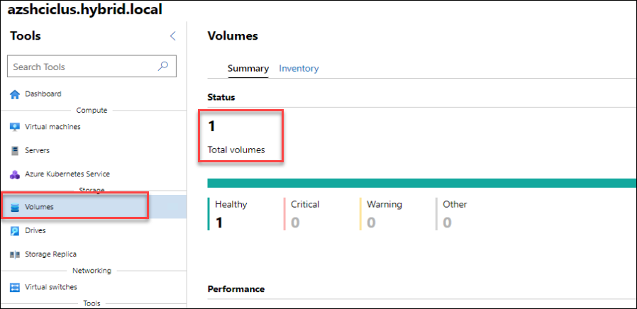
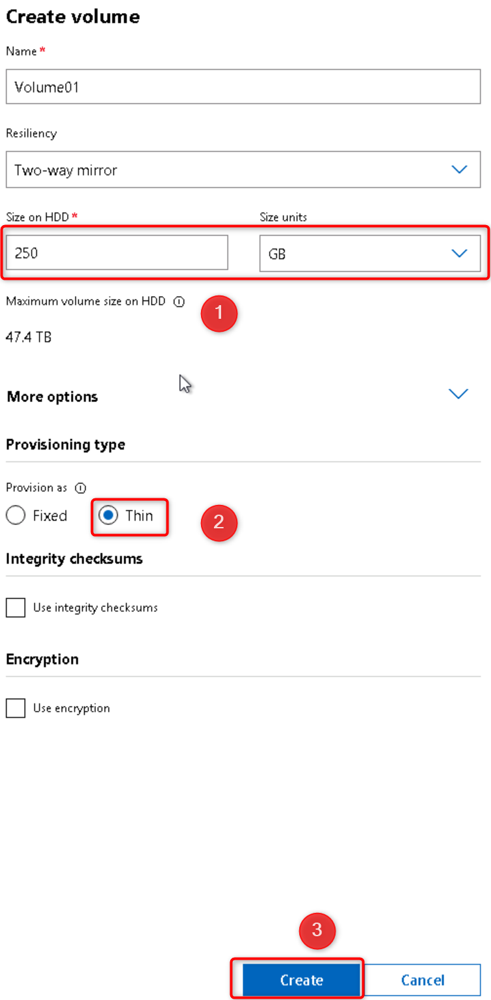
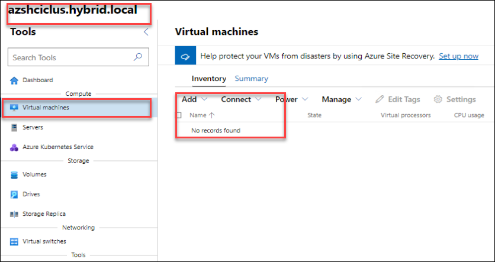
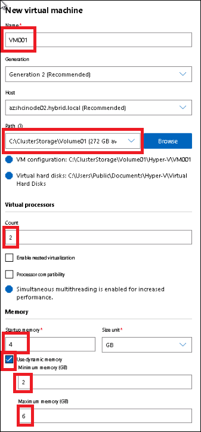
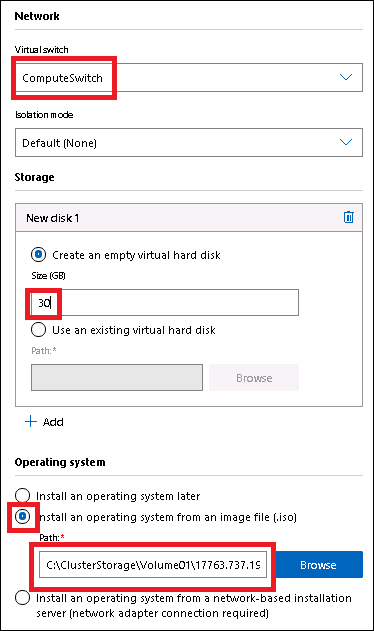
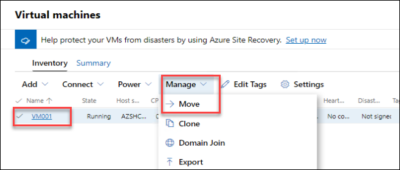
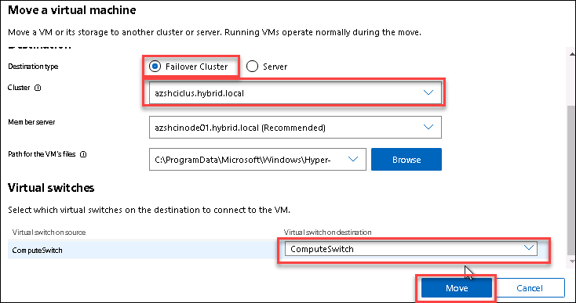
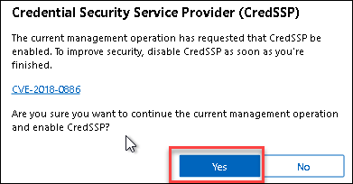

HOL-4: Exercise 4: Explore the management of your Azure Stack HCI 21H2 environment 
==============
Overview
-----------
With the Azure Stack HCI cluster deployed, you can now begin to explore some of the additional capabilities within Azure Stack HCI 21H2 and Windows Admin Center. We'll cover a few recommended activities below, to expose you to some of the key elements of the Windows Admin Center, but for the rest, we'll [direct you over to the official documentation](https://docs.microsoft.com/en-us/azure-stack/hci/ "Azure Stack HCI 21H2 documentation").

Contents
-----------
- [Overview](#overview)
- [Contents](#contents)
- [Create volumes for VMs](#create-volumes-for-vms)
- [Deploy a virtual machine](#deploy-a-virtual-machine)
- [Congratulations!](#congratulations)

Task 1: Create volumes for VMs
-----------
In this step, you'll create a volume on the Azure Stack HCI 21H2 cluster by using Windows Admin Center, and enable data deduplication and compression.

### Create a two-way mirror volume ###

1. Open **Windows Admin Center** on **HybridHost001** from the desktop is not already opened, click on your previously deployed cluster, **azshciclus.hybrid.local**

    
        
2. On the left hand navigation, under **Storage** select **Volumes**.  The central **Volumes** page shows you should have a single volume currently

    
    
4. On the Volumes page, select the **Inventory** tab, and then select **Create**

    
    
6. In the **Create volume** pane, leave the default for for the volume name, and leave **Resiliency** as **Two-way mirror**

7. In Size on HDD, specify **250GB** for the size of the volume

8. Under **More options**, tick the box for **Use deduplication and compression**

9. Under **Data type**, use the drop-down to select **Hyper-V**, then click **Create**.

    

10. Creating the volume can take a few minutes. Notifications in the upper-right will let you know when the volume is created. The new volume appears in the Inventory list

    

     > **NOTE** - You'll notice there are 3 options for **Data type**; default, Hyper-V and Backup.  If you're interested in learning more about Deduplication in Azure Stack HCI 21H2, you should [refer to our documentation](https://docs.microsoft.com/en-us/windows-server/storage/data-deduplication/overview "Deduplication overview")

You now have a volume created and ready to accept workloads. Whilst we deployed the volume using the Windows Admin Center, you can also do the same through PowerShell. If you're interested in taking that approach, [check out the official docs that walk you through that process](https://docs.microsoft.com/en-us/azure-stack/hci/manage/create-volumes "Official documentation for creating volumes"). For more information on planning volumes with Azure Stack HCI 21H2, you should [refer to the official docs](https://docs.microsoft.com/en-us/azure-stack/hci/concepts/plan-volumes "Planning volumes for Azure Stack HCI 21H2").

Task 2: Download Windows Server .Iso
-----------
 
1. Please download Windows Server 2019 image file from [here](https://nam06.safelinks.protection.outlook.com/?url=https%3A%2F%2Fwww.microsoft.com%2Fen-us%2Fevalcenter%2Fevaluate-windows-server-2019%3Ffiletype%3DISO&data=04%7C01%7CFrancisco.Teles%40microsoft.com%7C3f8c97077c47407ea5e108d995653e46%7C72f988bf86f141af91ab2d7cd011db47%7C1%7C0%7C637705084332755360%7CUnknown%7CTWFpbGZsb3d8eyJWIjoiMC4wLjAwMDAiLCJQIjoiV2luMzIiLCJBTiI6Ik1haWwiLCJXVCI6Mn0%3D%7C1000&sdata=zUzaHW7hF2BaYdzgw4wd79kNG2p201m775JKlJTveUc%3D&reserved=0)
 
2. Select ISO and complete the form to continue with your details. Download the .iso and saved in the Downloads folder.
 
3. Open Windows Admin Center on HybridHost001 from the desktop is not already opened, click on your previously deployed cluster, azshciclus.hybrid.local
 
    
 
4. On the left hand navigation, under Compute select Servers and then Inventory.
 
    

5. Click on node AZSHCINODE01 and then click in Manage
 
    
 
6. On the left, select Files & file sharing
  
    
  
7. Open the folder C:\ClusterStorage\Volume01
 
    
  
 
8. Click in the "…" and then Upload
 
    
  
9. Click in Select Files, search for the .iso file in Downloads and click in Open, and then Submit. 
 
    
 
10. It takes around 5 minutes to get successfully uploaded. After that, please move on to the next task.
 
 
Task 3: Deploy a virtual machine
----- 
1. Once logged into the **Windows Admin Center** on **HybridHost001**, click on your previously deployed cluster, **azshciclus.hybrid.local**

1. On the left hand navigation, under **Compute** select **Virtual machines**.  The central **Virtual machines** page shows you no virtual machines deployed currently
    
    

1. On the **Virtual machines** page, select the **Inventory** tab, and then click on **Add** and select **New**.

    
 
1. In the New virtual machine pane, enter VM001 for the name, and enter the following pieces of information, then click Create
 
     * Generation: Generation 2 (Recommended)
 
     * Host: Leave as recommended
 
     * Path: C:\ClusterStorage\Volume01
 
     * Virtual processors: 2
 
     * Startup memory (GB): 4
 
     * Use dynamic memory: Min 2, Max 6
 
     * Network: ComputeSwitch
 
     * Storage: Add, then Create an empty virtual hard disk and set size to 30GB
 
     * Operating System: Install an operating system from an image file (.iso)
 
      
      
        
 
1. The creation process will take a few moments, and once complete, VM001 should show within the Virtual machines view

1. Click on the checkbox before the VM and then click click on Power button and select Start - within moments, the VM should be running.

    
     
    
  
1. Click on VM001 to view the properties and status for this running VM.
 
    
 
1. Click on Connect and select connect button from the drop down- you may get a VM Connect prompt:
 
    
 
1. Click on Go to Settings and in the Remote Desktop pane, click on Allow remote connections to this computer, then Save
 
    
      
1. Click the Back button in your browser to return to the VM001 view, then click Connect, and when prompted with the certificate prompt, click Connect and enter Password as `demo!pass123`.

  
    
 
 
1. The VM will be in the UEFI boot summary as below
 
    
 
1. Click in "Send Ctrl + Alt +Del" at the top of the page now and press any key when you see the message "Press any key at boot from CD or DVD…"
 
    
 
1. Click Enter when you see the following interface
 
    
 
1. From there you'll start the OOBE experience. Select the following settings according to your preferences: Language, Time currency and Keyboard

1. Click Install Now, and select the version Windows Server 2019 Standard Evaluation (Desktop Experience):
 
     
 
1. Accept the license terms and select "Custom: Install Windows only (advanced)" and then Next. It will take around 10 minutes for the VM to boot. After that, please insert the lab credentials demo!pass123 and your VM is ready to go!

### Live migrate the virtual machine ###

The final step we'll cover is using Windows Admin Center to live migrate VM001 from it's current node, to an alternate node in the cluster.

1. Still within the **Windows Admin Center** on **HybridHost001**, under **Compute**, click on **Virtual machines**

2. On the **Virtual machines** page, select the **Inventory** tab

3. Under **Host server**, make a note of the node that VM001 is currently running on.  You may need to expand the column width to see the name

4. Next to **VM001**, click the tick box next to VM001, then click **More**.  You'll notice you can Clone, Domain Join and also Move the VM. Click **Move**

    

5. Select the **Failover Cluster** from the drop down and leave the defaul on **Member server** and **Path for the VM's file**, under the **ComputeSwitch** select **Computeswitch** and then click **Move**.

    
    
6. The live migration will then begin, and within a few seconds, the VM should be running on a different node.
     
7. Click on **Yes** on the popup of **Credential Security Service Provider CredSSP** and then enter you username as **Hybrid\azureuser** and password as **demo!pass123**.

    
    
8. On the left hand navigation, under **Compute** select **Virtual machines** to return to the VM dashboard view, which aggregates information across your cluster, for all of your VMs.
